# Features Changer
This ai is used to modify features in an image, for instance removing glasses.

## Preview
### Feature grid
Here we follow this equation (strength is a constant with value 1.5) :

```
z = z + feature_vector * strength
```

Using DCAE :

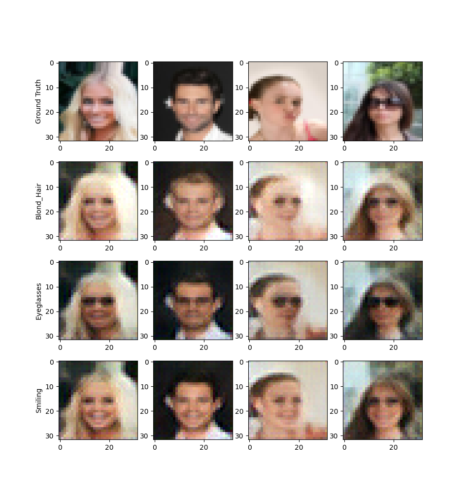

Using PGAE :

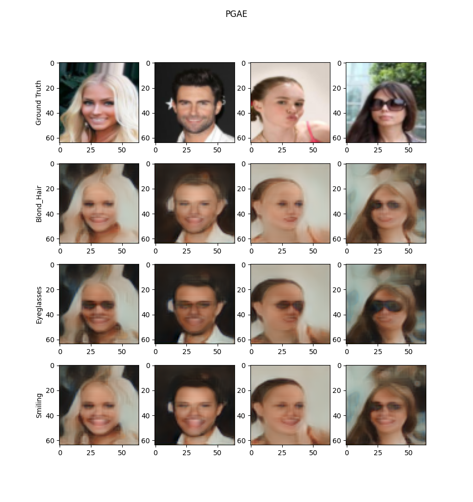

### Add / remove feature
| Name | DCAE | PGAE | Equation |
| ---- | ---- | ---- | -------- |
| Remove smile |  | 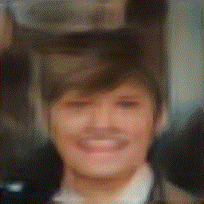 | z_end = z_start - z_smile * 2 |
| Add blond hairs | 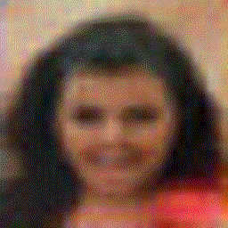 | 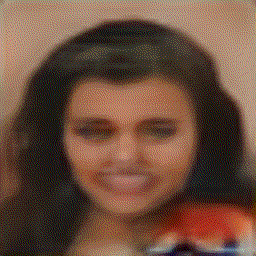 | z_end = z_start + z_blond * 2 |
| Add mustache | 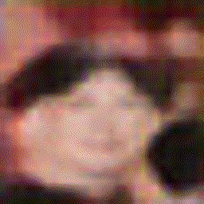 | 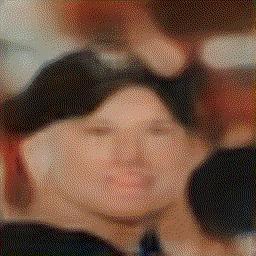 | z_end = z_start + z_mustache * 2 |
| Remove blond hairs | 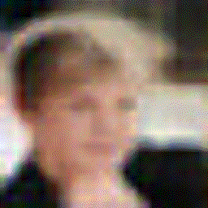 | 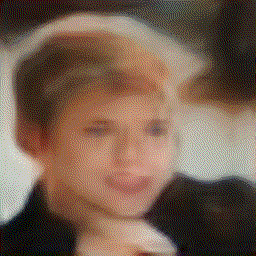 | z_end = z_start - z_blond * 2 |

### Image to image
| Start | End | DCAE | PGAE |
| ----- | --- | ---- | ---- |
|  |  | 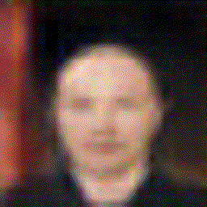 | 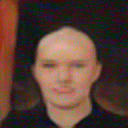 |
|  |  |  |  |
|  |  |  |  |

## Structure
<!-- params update ? -->

- data : Dataset analysis
- display : Functions to plot and show data
- net : Network models
- params : Hyper parameters
- train : Training functions and statistics
- user : User config (not on git, more details bellow)

## User config
Some user specific properties are gathered within the module src/user.py.
This module is not on git, you must create it.
Here are all properties of this file :

- dataset\_path, string : Where the root of the dataset is

## Dataset
The dataset used to train the network and to make statistics is the [celeba
dataset](http://mmlab.ie.cuhk.edu.hk/projects/CelebA.html).
Since it is complicated to download it via pytorch, it was downloaded from
[kaggle](https://www.kaggle.com/jessicali9530/celeba-dataset).

### Tree view
```
celeba
├── img_align_celeba
│  └── img_align_celeba
│     ├── 000001.jpg
│     └── ...
├── img_align_celeba
├── list_attr_celeba.csv
├── list_bbox_celeba.csv
├── list_eval_partition.csv
└── list_landmarks_align_celeba.csv
```
