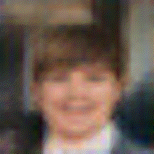
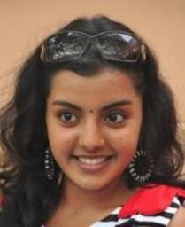
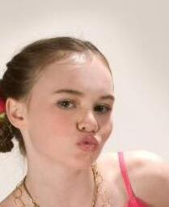

# Features Changer
This ai is used to modify features of an image, for instance removing glasses, add blond hairs or add a smile.

To achieve this, an AutoEncoder network has been used with multiple models such as Deep Convolutional or Progressive Growing architectures.
Furthermore, to improve the sharpness of the results, a Deep Feature Consistent loss was used.

## Preview
All results are obtained with 30 minutes of training using Google Colab.

### Feature grid
Here we follow this equation (strength is a constant with value 1.5) :

```
z_new = z + feature_vector * strength
```

Feature vectors are obtained by sampling 1000 images featuring this attribute and
1000 images without it. Then, we compute the average difference :

```
N = 1000
feature_vector = (z_positive - z_negative) / N
```


### Add / remove features
These GIFs represent a linear interpolation of latent vectors between
the representation of an image (z_start) and its feature changed representation (z_end).

| Name | DCAE | PGAE | Equation |
| ---- | ---- | ---- | -------- |
| Remove smile |  |  | z_end = z_start - z_smile * 2 |
| Add blond hairs |  |  | z_end = z_start + z_blond * 2 |
| Add mustache |  |  | z_end = z_start + z_mustache * 2 |
| Remove blond hairs |  |  | z_end = z_start - z_blond * 2 |

### Image to image
Similar to the previous section, this one delineates the linear interpolation between
two image representations.

| Start | End | DCAE | PGAE |
| ----- | --- | ---- | ---- |
|  |  |  |  |
|  |  |  |  |
|  |  |  |  |

## Network architectures

Two different autoencoders architectures have been used :

### DCAE
The Deep Convolutional AutoEncoder is the simplest architecture,
composed of convolution, pooling, upsampling and batch normalization layers.
The image resolution is 32x32 px and the latent vector is composed of 100 values.

### PGAE
The Progressive Growing AutoEncoder architecture is similar to the one described in [this paper](https://arxiv.org/abs/1710.10196).
Of course, this model is an auto encoder, not a GAN.
All layers are based on DCAE but the training method is different.
We progressively add layers that increase the image resolution from 8x8 to 64x64 px.

### Deep Feature Consistent loss
Furthermore, to improve image's sharpness, a deep feature consistent loss has been added
like described in [this paper](https://arxiv.org/abs/1610.00291).
The target and the output are passed through a pretrained VGG19 network and MSE losses
between the first three VGG layers are summed to produce the total loss.
For the PGAE model, this loss is used only for 'high resolution' layers with a size of at
least 32x32 px (otherwise, MSE is used).
This has been implemented thanks to [this repo](https://github.com/ku2482/vae.pytorch) (MIT license).

### Results
It turns out that the DCAE model outputs better results even though the resolution is twice
as small compared to PGAE images.

## Structure
- data : Dataset analysis
- display : Functions to plot and show data
- net : Network models
- params : Hyper parameters
- train : Training functions and statistics
- user : User config (not on git, more details bellow)

### User config
Some user specific properties are gathered within the module src/user.py.
This module is not on git, you must create it.
Here are all properties of this file :

- dataset\_path, string : Where the root of the dataset is

## Dataset
The dataset used to train the network and to make statistics is the [celeba
dataset](http://mmlab.ie.cuhk.edu.hk/projects/CelebA.html).
Since it is complicated to download it via pytorch, it was downloaded from
[kaggle](https://www.kaggle.com/jessicali9530/celeba-dataset).

### Tree view
```
celeba
├── img_align_celeba
│  └── img_align_celeba
│     ├── 000001.jpg
│     └── ...
├── img_align_celeba
├── list_attr_celeba.csv
├── list_bbox_celeba.csv
├── list_eval_partition.csv
└── list_landmarks_align_celeba.csv
```

## Contributing
This repo is under the [MIT License](LICENSE).
Contributions are welcome, feel free to add another model or to tune hyperparameters.

## Sources
- [Progressive Growing GANs](https://arxiv.org/abs/1710.10196)
- [Deep Feature Consistent VAE](https://arxiv.org/abs/1610.00291)
- [Deep Feature Consistent VAE (pytorch implementation)](https://github.com/ku2482/vae.pytorch)
- [Celeba Dataset](http://mmlab.ie.cuhk.edu.hk/projects/CelebA.html)
- [Celeba Dataset (kaggle)](https://www.kaggle.com/jessicali9530/celeba-dataset)
